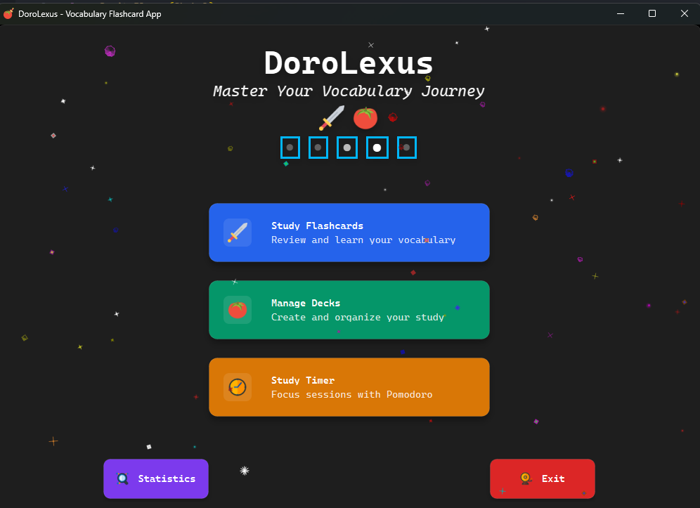

# DoroLexus - Vocabulary Flashcard App

A modern flashcard application built with PySide6, similar to Anki, designed to help you study vocabulary efficiently using spaced repetition.



## Features

- **🎨 Modern UI Design**: Beautiful cosmic-themed interface with animated background and smooth transitions
- **📚 Spaced Repetition Learning**: Intelligent algorithm that schedules cards based on your performance
- **🎴 Interactive Flashcards**: Beautiful flip animations and intuitive study interface with Cascadia Code font
- **📁 Deck Management**: Create, organize, and manage multiple flashcard decks with card-like interface
- **📊 Progress Tracking**: Detailed statistics and analytics of your study progress
- **🎯 Study Modes**: Focus on specific decks or study all cards due for review
- **⏰ Study Timer**: Built-in timer for focused study sessions
- **💾 Local Storage**: All data stored locally in SQLite database
- **🎭 Responsive Design**: Adaptive layout that works on different window sizes

## Installation

1. **Install Python 3.8+** if you haven't already
2. **Install PySide6**:
   ```bash
   pip install -r requirements.txt
   ```
3. **Run the application**:
   ```bash
   python main.py
   ```

## Getting Started

### 1. Launch the Application
- Run `python main.py` or double-click `run_app.bat` (Windows)
- Enjoy the beautiful cosmic-themed welcome screen with animated background

### 2. Create Your First Deck
- Click "Manage Decks" from the main menu
- Click the "+ New Deck" card to create a new flashcard deck
- Enter a name and optional description for your deck
- Click "Save Deck" to create it

### 3. Add Flashcards
- Select your deck from the card gallery
- Click "+ Add Card" to create new flashcards
- Enter the question on the front and answer on the back
- Click "Save Card" to save the card

### 4. Start Studying
- Go back to the main menu and click "Study Flashcards"
- Select the deck you want to study from the card grid
- Click "Show Answer" to reveal the back of the card
- Rate your performance:
  - **Again** (0): Incorrect, needs more practice
  - **Hard** (1): Correct but difficult
  - **Good** (3): Correct with normal difficulty
  - **Easy** (4): Correct and easy
  - **Perfect** (5): Correct and very easy

### 5. Track Your Progress
- Click "Statistics" to view your study progress
- See overall statistics, recent activity, and daily progress
- Filter statistics by specific decks

### 6. Use the Study Timer
- Click "Study Timer" for focused study sessions
- Set custom timer durations for productive study blocks

## UI/UX Features

### 🎨 Visual Design
- **Cosmic Theme**: Beautiful animated starfield background with twinkling stars
- **Modern Typography**: Cascadia Code font throughout the application for a clean, developer-friendly look
- **Smooth Animations**: Elegant transitions and hover effects on all interactive elements
- **Card-Based Interface**: Intuitive card layouts for decks, making navigation feel natural

### 🎭 Responsive Design
- **Adaptive Layout**: Automatically adjusts to different window sizes
- **Smart Spacing**: Menu buttons intelligently space themselves based on available screen space
- **Centered Content**: All content remains perfectly centered regardless of window size
- **Scroll Support**: Graceful scrolling for content that exceeds screen boundaries

### 🎯 User Experience
- **Intuitive Navigation**: Clear visual hierarchy and logical flow between pages
- **Consistent Theming**: Unified dark theme with blue accent colors throughout
- **Hover Feedback**: Visual feedback on all interactive elements
- **Keyboard Support**: Full keyboard navigation support

## How Spaced Repetition Works

The app uses a simplified version of the SM-2 algorithm:

- **Correct answers** (rating 3-5) increase the interval between reviews
- **Incorrect answers** (rating 0-2) reset the card to be reviewed again soon
- **Easy cards** get longer intervals, **hard cards** get shorter intervals
- Cards are automatically scheduled based on your performance

## File Structure

```
DoroLexus/
├── main.py                 # Main application entry point
├── requirements.txt        # Python dependencies
├── run_app.bat            # Windows batch file to run the app
├── data/                  # Application assets
│   └── images/            # SVG icons and graphics
├── docs/                  # Documentation
│   └── images/            # Screenshots and documentation images
├── src/
│   ├── __init__.py
│   ├── core/              # Core functionality
│   │   ├── database.py    # Database management and spaced repetition
│   │   └── paths.py       # Asset path management
│   ├── ui/                # Layout components and theming
│   │   ├── deck_card_layout.py      # Deck card components
│   │   ├── page_header_layout.py    # Page header components
│   │   ├── dialog_layout.py         # Dialog components
│   │   ├── page_content_layout.py   # Page content components
│   │   ├── theme.py                 # Global theming
│   │   └── menu_config.py           # Configuration
│   ├── widgets/           # Reusable widget components
│   │   ├── welcome_banner_widget.py # Animated welcome banner
│   │   ├── vertical_menu_widget.py  # Main menu cards
│   │   ├── nav_menu_widget.py       # Navigation buttons
│   │   ├── flashcard_widget.py      # Interactive flashcard display
│   │   └── button_widget.py         # Button components
│   ├── pages/             # Page logic and layouts
│   │   ├── home_page.py   # Main home page
│   │   ├── study_page.py  # Study interface
│   │   ├── decks_page.py  # Deck management
│   │   ├── stats_page.py  # Statistics page
│   │   └── timer_page.py  # Study timer page
│   ├── modes/             # Business logic implementations
│   │   ├── study_impl.py  # Study mode implementation
│   │   ├── decks_impl.py  # Deck management implementation
│   │   └── stats_impl.py  # Statistics implementation
│   ├── animation/         # Animation components
│   │   └── cosmic_particles.py # Cosmic background animation
│   └── main/              # Main application window
│       └── window.py      # Application window management
└── README.md
```

## Database Schema

The app uses SQLite with the following tables:
- **decks**: Stores flashcard decks
- **cards**: Stores individual flashcards
- **study_sessions**: Tracks spaced repetition data
- **statistics**: Records daily study statistics

## Tips for Effective Learning

1. **Be Consistent**: Study a little bit every day rather than cramming
2. **Rate Honestly**: Accurate ratings help the algorithm work better
3. **Create Good Cards**: Make clear, concise questions and answers
4. **Review Regularly**: Don't let too many cards pile up for review
5. **Use Multiple Decks**: Organize different subjects into separate decks

## Troubleshooting

- **App won't start**: Make sure PySide6 is installed correctly and Python 3.8+ is being used
- **Database errors**: Delete `src/data/dorolexus.db` to reset the database
- **Import issues**: Ensure all files are in the correct directory structure
- **Animation not showing**: Make sure your graphics drivers are up to date
- **Font issues**: Cascadia Code font will fall back to system monospace fonts if not available
- **Performance issues**: Try reducing the number of animated stars in the cosmic background

## License

This project is open source and available under the MIT License.

## Contributing

Feel free to submit issues, feature requests, or pull requests to improve the application!

---

Happy studying! 📚✨
